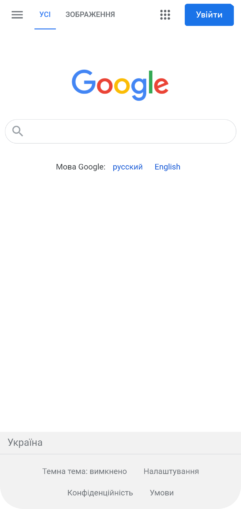
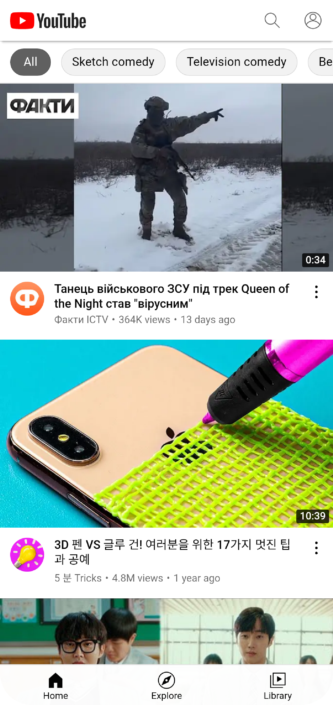

# GravityTest App

Приложение GravityTest App состоит из двух экранов: экран закгрузки и экран WebView.
При запуске приложения выполняется запрос на сервер для получения двух ссылок: "link" и "home".
Если приложение запускается первый раз, то запускается ссылка "link", ссылка "home" запускается при последующих запусках приложения

